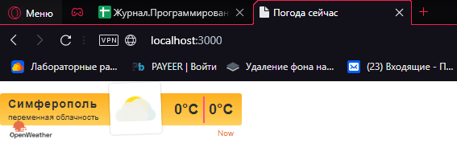
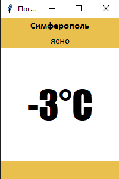

<p align="center">МИНИСТЕРСТВО НАУКИ  И ВЫСШЕГО ОБРАЗОВАНИЯ РОССИЙСКОЙ ФЕДЕРАЦИИ<br>
Федеральное государственное автономное образовательное учреждение высшего образования<br>
"КРЫМСКИЙ ФЕДЕРАЛЬНЫЙ УНИВЕРСИТЕТ им. В. И. ВЕРНАДСКОГО"<br>
ФИЗИКО-ТЕХНИЧЕСКИЙ ИНСТИТУТ<br>
Кафедра компьютерной инженерии и моделирования</p>
<br>
<h3 align="center">Отчёт по лабораторной работе № 1<br> по дисциплине "Программирование"</h3>
<br><br>
<p>студента 1 курса группы ПИ-б-о-201(2)<br>
Котляра Даниила Евгеньевича<br>
направления подготовки 09.03.04 "Программная инженерия"</p>
<br><br>
<table>
<tr><td>Научный руководитель<br> старший преподаватель кафедры<br> компьютерной инженерии и моделирования</td>
<td>(оценка)</td>
<td>Чабанов В.В.</td>
</tr>
</table>
<br><br>
<p align="center">Симферополь, 2020</p>
<hr>

<!--  -->
## Цель:

1. Закрепить навыки разработки многофайловыx приложений;
2. Изучить способы работы с API web-сервиса;
3. Изучить процесс сериализации/десериализации данных в/из json;
4. Получить базовое представление о сетевом взаимодействии приложений;

## Постановка задачи
Разработать сервис предоставляющий данные о погоде в городе Симферополе на момент запроса. В качестве источника данных о погоде использовать: http://openweathermap.org/. В состав сервиса входит: серверное приложение на языке С++ и клиентское приложение на языке Python.
Серверное приложение (далее Сервер) предназначенное для обслуживания клиентских приложений и минимизации количества запросов к сервису openweathermap.org. Сервер должен обеспечивать возможность получения данных в формате JSON и виде html виджета (для вставки виджета на страницу будет использоваться iframe).
Клиентское приложение должно иметь графический интерфейс отображающий сведения о погоде и возможность обновления данных по требованию пользователя.

## Выполнение работы
<!--
    API key полученный на сервисе openweathermap.org;
    Запрос составленный в пункте I.7;
    Запрос составленный в пункте II;
    Полный исходный код серверного приложения;
    Полный исходный код клиентского приложения;
    Скриншот графического интерфейса клиентского приложения. Только окно программы, лишнее обрезать;
    Скриншот браузера с загруженными виджетом.
-->
Для начала был зарегистрирован аккаунт openwheatermap.org. API ключ по-умолчанию созданный сервисом: a9c029b1f8f08c04c0f08350bd7b6f5e.

Затем были произведены несколько тестовых запросов, чтобы убедиться, что они не имеют ошибок и вывод правилен.

Запрос, созданный к серверу погоды включает в себя широту и долготу места, для которого необходимо получить погоду, исключить все типы прогноза кроме почасового, ключ API, метрические единицы изменения (цельсий) и описание на русском языке: 

api.openweathermap.org/data/2.5/onecall?lat=44.952116&lon=34.102411&appid=a9c029b1f8f08c04c0f08350bd7b6f5e&units=metric&lang=ru

Запрос для сервера погоды включает в себя город, время которого необходимо получить:

http://worldtimeapi.org/api/timezone/Europe/Simferopol

Исходный код сервера:
```cpp
// Файл weather.cpp
#include <iostream>
#include <fstream>
#include <string>
#include <ctime>
#include <iomanip>
#include <cpp_httplib/httplib.h>
#include <nlohmann/json.hpp>
using namespace std;
using namespace httplib;
using json = nlohmann::json;

void findAndReplaceAll(string &data, string toSearch, string replaceStr) {
	size_t pos = data.find(toSearch);
	while (pos != string::npos) {
		data.replace(pos, toSearch.size(), replaceStr);
		pos = data.find(toSearch, pos + replaceStr.size());
	}
}

json get_time() {
	Client taim("http://worldtimeapi.org");
	auto res = taim.Get("/api/timezone/Europe/Simferopol");
	return json::parse(res->body);
}

json get_weather() {
	Client weather("http://api.openweathermap.org");
	auto res = weather.Get("/data/2.5/onecall?lat=44.952116&lon=34.102411&appid=a9c029b1f8f08c04c0f08350bd7b6f5e&units=metric&lang=russian");
	return json::parse(res->body);
}

json get_forecast(const json &hourly) {
	json hour_forecast, taim = get_time();;
	int last = hourly.size() - 1;
	if (hourly[last]["dt"] < taim["unixtime"])
		return json::object();
	for (int i = 0; i <= last; ++i) {
		if (hourly[i]["dt"] >= taim["unixtime"]) {
			hour_forecast = hourly[i];
			break;
		}
	}
	return hour_forecast;
}

json get_cache() {
	json cache;
	ifstream file("cache.json");
	if (file.is_open()) {
		string content;
		getline(file, content, '\0');
		if (!content.empty())
			cache = json::parse(content);
		file.close();
	}
	return cache;
}

bool cache_json(json cache) {
	ofstream file("cache.json");
	if (file.is_open()) {
		file << cache;
		file.close();
	}
	else return 0;
	return 1;
}

void gen_response(const Request& req, Response& res) {
	json body, hour_forecast;
	body = get_cache();
	if (body.empty()) {
		body = get_weather();
		cache_json(body);
	}
	hour_forecast = get_forecast(body["hourly"]);
	ifstream file("template.html");
	string site;
	if (file.is_open()) {
		getline(file, site, '\0');
		file.close();
	}
	else {
		res.set_content("Cannot open template file.", "text/plain;charset=utf-8");
		return;
	}

	findAndReplaceAll(site, "{hourly[i].weather[0].description}",
		hour_forecast["weather"][0]["description"]);
	findAndReplaceAll(site, "{hourly[i].weather[0].icon}",
		hour_forecast["weather"][0]["icon"]);
	findAndReplaceAll(site, "{hourly[i].temp}",
		to_string(int(round(hour_forecast["temp"].get<double>()))));
	res.set_content(site, "text/html;charset=utf-8");
}

void gen_response_raw(const Request &req, Response &res) {
	json hour_forecast, body, out;
	string site;
	ifstream file("template.html");
	body = get_cache();
	if (body.empty())
		body = get_weather();
	hour_forecast = get_forecast(body["hourly"]);
	cache_json(body);
	if (file.is_open()) {
		getline(file, site, '\0');
		file.close();
	}
	out["temp"] = hour_forecast["temp"];
	out["description"] = hour_forecast["weather"][0]["description"];
	res.set_content(out.dump(), "text/json;charset=utf-8");
}

int main() {
	Server svr;
	svr.Get("/", gen_response);
	svr.Get("/raw", gen_response_raw);
	svr.listen("localhost", 3000);
}

```

Исходный код клиента:
```python
from tkinter import *
import json
import requests

def reload_data(event=None):
	try:
		response = requests.get('http://localhost:3000/raw').content.decode("utf8")
		forecast_j = json.loads(response)

		desc.config(text=str(forecast_j["description"]))
		temp.config(text=str(round(forecast_j["temp"])) + "°C")
	except requests.exceptions.ConnectionError:
		pass

root = Tk()
root.geometry('200x270')
root.title("Погода")
root.bind("<Button-1>", reload_data)

yellow, white = "#e9c04d", "#ffffff"
w, h = 100, 30

top =    Frame(root, bg=yellow, width=w, height=h)
middle = Frame(root, bg=white,  width=w, height=h*3)
bottom = Frame(root, bg=yellow, width=w, height=h)

top.pack(side=TOP, fill=X)
middle.pack(expand=True, fill=BOTH)
bottom.pack(side=BOTTOM, fill=X)

city = Label(top, font=("Calibri Bold", 12), text="Симферополь", bg=yellow)
desc = Label(top, font=("Calibri", 12), bg=yellow)
temp = Label(middle, font=("Impact", 48), bg=white)

city.pack(pady=0)
desc.pack(pady=0)
temp.pack(expand=True)

reload_data()
root.mainloop()
```

Скриншот виджета:



Скриншот клиента:



## Вывод по работе. 
Цель работы была успешно достигнута. Было выполнено:
- Создание сервера на языке С++, обращающегося к openweathermap.com и возвращающий виджет или описание и температуру в формате json
- Приложение с графическим интерфейсом, написанное на языке Python с использованием библиотеки Tkinter, получающее и обрабатывающее данные из сервера.